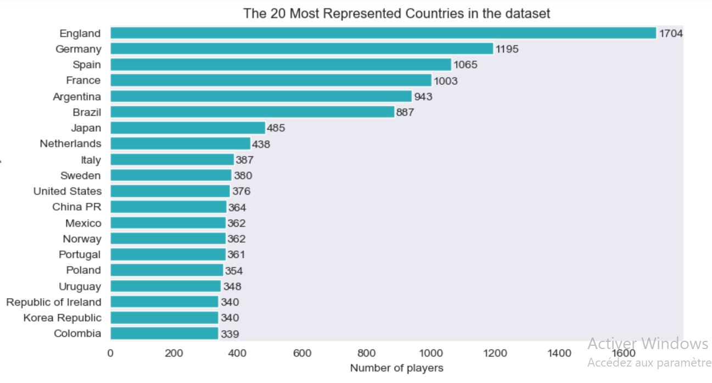
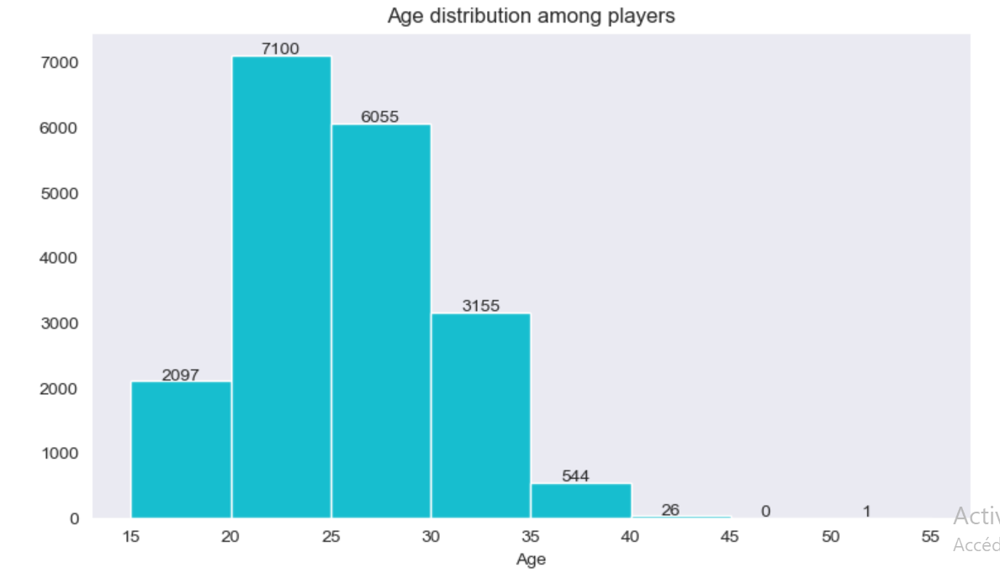

# EA Sports FIFA21 Data Cleaning Project 🎮

## Project Overview 📝

In this exciting project, we tackled the challenging task of cleaning a **messy and raw dataset** of EA Sports FIFA21, which was scraped from sofica.com 🕸️. You can read more about this dataset [here](https://www.kaggle.com/datasets/yagunnersya/fifa-21-messy-raw-dataset-for-cleaning-exploring?select=fifa21+raw+data+v2.csv). Leveraging the power of **Python** 🐍, we used **pandas** 🐼 and **regular expressions** 🔍 to wrangle and refine the dataset. As a cherry on top, we added some dazzling **visualizations** 📊 to reveal fascinating insights.

## Dataset 🗄️

The dataset we worked with comprises player attributes, such as player names, ratings, positions, clubs, and more. Initially, it resembled a labyrinth of untamed data, but we fearlessly dived in to tame it and make it ready for analysis 🦁.

## Installation 🛠️

To run our awe-inspiring data cleaning scripts, you'll need **Python** and the following magnificent libraries:

- pandas 🐼
- numpy 🔢
- matplotlib 📊
- seaborn 🌊

You can install these libraries using pip: `pip install pandas numpy matplotlib seaborn`.

You can also have all these libraries by installing anaconda.

## Data Cleaning ✨

With the combined powers of pandas and regular expressions, we performed a spellbinding data cleaning process:

1. **Handling Missing Values**: We mended the gaps in the dataset, making it whole again 🧩.
2. **Standardizing Data**: We brought uniformity to the chaos, ensuring consistency in the dataset 🌈.
3. **Removing Duplicates**: We vanquished duplicates to create a harmonious dataset 🗑️.
4. **Extracting Relevant Information**: We used regex power to extract valuable insights from text fields.
5. **Data Type Conversion**: We performed alchemy, transforming data types as needed 🧪.

## Visualizations 📊

Our work wouldn't be complete without enchanting visualizations! Feast your eyes on these mesmerizing plots:

## Contributing 🤝

We welcome fellow data lovers to join our quest to improve this project! Whether you spot a bug, have a suggestion, or wish to add more magic, open an issue or submit a pull request. Let's make this project legendary together! 🏰

---
Thanks for your interest in our EA Sports FIFA21 Data Cleaning Project! For any questions or inquiries, don't hesitate to reach out to our wonderful team.

